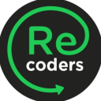

# Hackatón Recoders 2020

Bienvenidos a la primera Hackatón para reconvertidos digitales!

Esta iniciativa tiene como principal objetivo que nuestros integrantes Recoders pongan a prueba sus competencias digitales y se desafíen a sí mismos en un entorno real.   

Puedes usar cualquier stack de tecnologías que domines `(Python - Django, Java - Spring Boot, Ruby - Rails, MERN, Vanilla JS, Flutter, React Native, Ionic, etc.)`. 

# Reglas

1. Se puede participar de forma individual o en equipo de máximo 3 integrantes.
2. Son 48 horas máximo para entregar el proyecto terminado `(incluido deployment)`.
3. Debe subirse a una plataforma cloud para que la aplicación sea ejecutada y que otros usuarios puedan acceder a ella `(por ejemplo heroku, aws, gcp, github pages)`.
4. El proyecto debe subirse a una plataforma de control de versiones `(por ejemplo github, gitlab)`. 
5. En el repositorio del proyecto se debe incluir una pequeña documentación en donde se señale la descripción de sus funcionalidades y que señale quienes integraron el equipo.

# Categorías ganadoras

## Ada Lovelace Award

Seleccionaremos aquél proyecto en el que la ejecución de la idea innova en algún aspecto de su funcionalidad en comparación con otros o es una idea completamente nueva y jamás se ha visto en la historia de la programación. Crea algo **original** que hubiese hecho sentir orgullosa a la primera programadora de la historia.

---

## KISS Award

**Keep it short and simple!** Seleccionaremos el proyecto que sea simple, elegante y al grano `(por ejemplo: un minijuego en 100 líneas de código hecho en JS)`. La optimización e ingenio son la clave para ganar esta categoría.

---

## Mr. Robot Award

Seleccionaremos la aplicación que implemente la mayor cantidad de funcionalidades. Demuéstrales a los reclutadores que sabes consumir API's, implementar dependencias, bibliotecas de terceros, uso correcto de herencia e interfaces y más!

---

## The Devil Wears Prada Award 

Seleccionaremos el proyecto que mayor impacto estético genere en los usuarios. **Aquí el diseño UX/UI es lo fundamental**. Demuestra todo tu estilo y glamour como developer!

---

## Recoders Award

Ganará la aplicación que tenga como propósito *conectar a las personas*. Si quieres crear un proyecto que va en ayuda de otros y/o que resuelve algún problema social o comunitario en particular, este es tu espacio para participar!

---

# Premios

500 -> NullPointerException
